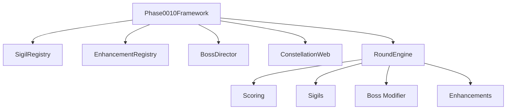

# Phase 00-10 Visual Overview

## Status Board

```text
[00] Mission Brief            :: implemented
[01] Foundation Lock          :: implemented
[02] Round Structure          :: implemented
[03] Scope Boundaries         :: implemented
[04] Emotional Fantasy        :: implemented
[05] Sigil Framework          :: implemented
[06] Sigil Archetypes         :: implemented
[07] Sigil Templates          :: implemented
[08] Constellation Weaving    :: implemented
[09] Enhancement Rules        :: implemented
[10] Boss Philosophy          :: implemented
```

## Phase Progression Diagram


## Runtime Architecture Diagram


